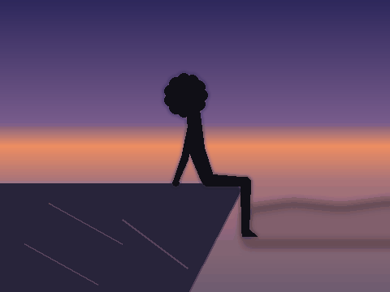

# 🌄🌧️ Man on a Cliff — Lying Back as the Rain Begins

An animated GIF of a tall, slim man with an afro sitting on the edge of a cliff
with his legs hanging over the drop. He gently lies back on the cliff top, and
then it begins to rain.



## The animation

1. The man sits on the cliff edge at dusk, legs dangling and gently swaying,
   backlit by the horizon glow.
2. He slowly leans back and lies down on his back on the cliff top.
3. Once he's settled, the sky darkens and rain starts to fall, steadily
   growing heavier.

The figure is a silhouette with a soft dusk rim-light; everything (sky, cliff,
figure, and rain) is drawn procedurally with [Pillow](https://python-pillow.org/)
— no external image assets.

## Regenerating it

```bash
pip install Pillow numpy
python3 make_cliff_figure_rain.py   # writes cliff_figure_rain.gif (480x360, 100 frames)
```

Tweak the constants at the top of `make_cliff_figure_rain.py` (`W`, `H`,
`FRAMES`, `FPS`, and the cliff/figure geometry) to change the size, speed, or
composition.
