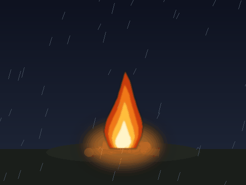
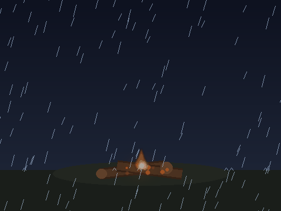

# 🔥🌧️ Fire Burning Out in the Rain

An animated GIF of a campfire being slowly extinguished by rain.



## The animation

1. A tall, flickering campfire on a dark, rainy night with light rain.
2. The rain steadily intensifies while the flame shrinks and sputters.
3. Steam puffs rise where the rain hits the dying fire.
4. The flame goes out — leaving smoldering logs, a wisp of smoke, faintly
   glowing embers, and heavy rain.

## The companion animation — fire reigniting

The reverse arc: a near-dead fire in heavy rain that comes back to life once
the rain stops.



1. Heavy rain over smoldering logs — only glowing embers, smoke, and steam.
2. The rain tapers off and stops.
3. The embers catch and a small flame flickers to life.
4. The flame grows back into a tall, lively blaze under a clear, calm night.

## Regenerating them

The GIFs are drawn entirely procedurally with [Pillow](https://python-pillow.org/) —
no external image assets are needed.

```bash
pip install Pillow
python3 make_fire_rain.py        # writes fire_rain.gif      (fire put out by rain)
python3 make_fire_reignite.py    # writes fire_reignite.gif  (fire reignites as rain stops)
```

Each output is 480x360, 90 frames. Tweak the constants at the top of either
script (`W`, `H`, `FRAMES`, `FPS`) to change the size or speed.
